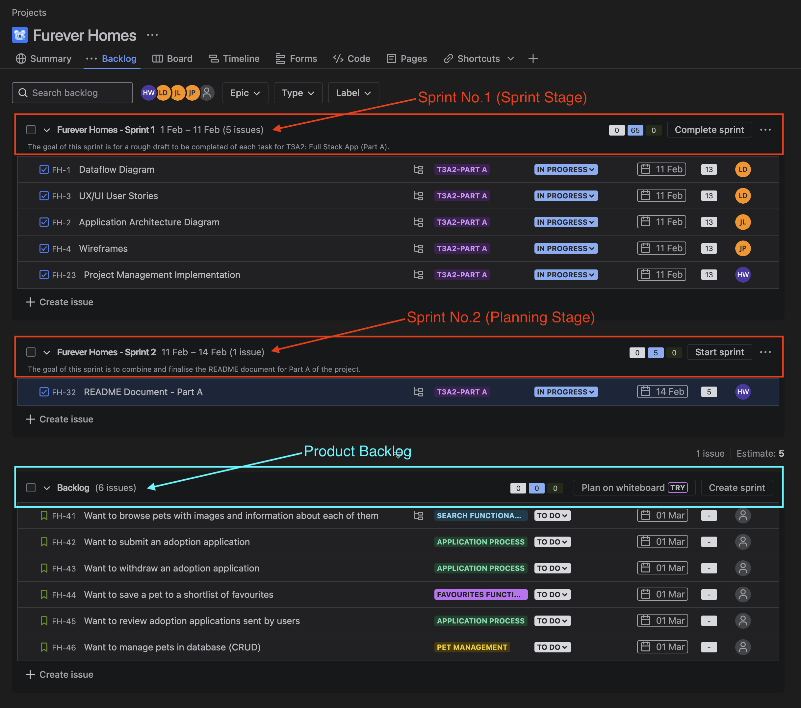
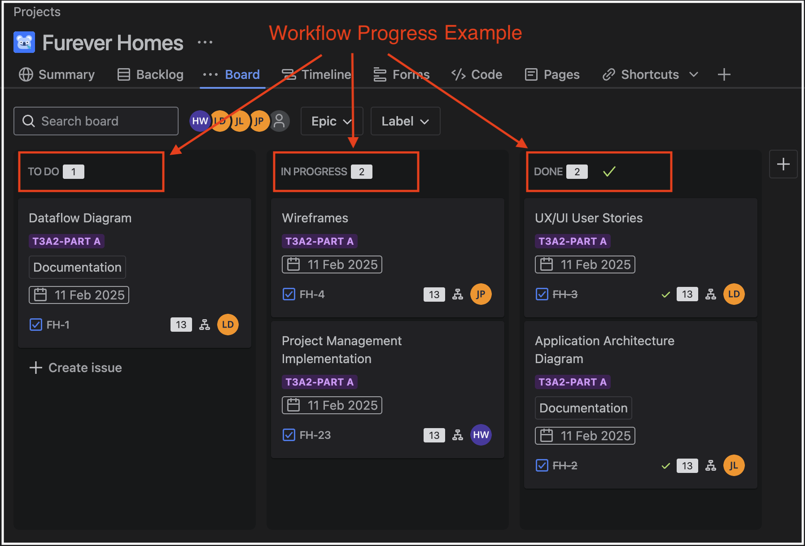

# Furever Homes 🏡🐶

A Pet Adoption & Shelter Management Application

## Contents

1) [What is "Furever Homes"?](#what-is-furever-homes)
2) [Dataflow Diagram](#dataflow-diagram)
3) [Application Architecture Diagram](#application-architecture-diagram)
4) [User Stories](#user-stories)
5) [Wireframes](#wireframes)
6) [Jira](#jira)

## What is "Furever Homes"?

Furever homes is a platform which is designed to provide a simple and easy pet adoption experience, while also delivering a way for animal shelters to manage their operations efficiently.

The application includes features such as:

- Pet search functionality with filtering options
- Ability for adopters to shortlist pets into a 'favourites' section
- Application processes (Submit, Approve, Reject)
- Pet Data Management (CRUD)
- Secure user registration & login using JWT Authentication

### Tech Stack

    
    
    
    
    
    

  

 

**CSS**: Provides styling and accomodates for a responsive web application / user interace.  
**JavaScript**: A flexible programming language which is utilised for both the frontend and backend logic of the application.  
**React**: A JavaScript library which allows developers to create dynamic web applications by utilising a component-based architecture.  
**Node.js**: A JavaScript runtime environment which allows JavaScript to run on the server.  
**Express**: A backend framework for Node.js which manages API requests, middleware & route handling.  
**MongoDB**: A NoSQL database solution that stores data in a JSON-like format.

## Dataflow Diagram

*(Insert Dataflow Diagram here)*

## Application Architecture Diagram

*(Insert Application Architecture Diagram here)*

## User Stories

### Persona 1

**Who**: Pet Adopter  
**What**: Want to browse pets with images and information about each of them  
**Why**: To explore potential pets that fit in with my lifestyle and preferences

**REFINEMENT**: Initially lacked filtering options, but was refined to have a filtering option to ensure there wasn't an overwhelming number of pets being displayed

### Persona 2

**Who**: Pet Adopter  
**What**: Want to submit an adoption application  
**Why**: In order to express interest in a particular pet and give necessary details to the shelter

**REFINEMENT**: Applications include personalised questions such as experience, home environment, other pets to help admins make better decisions

### Persona 3

**Who**: Pet Adopter  
**What**: Want to save pets to a shortlist of favourites  
**Why**: To be able to revisit the pets I'm interested in and be able to consider how they can fit into my life before committing immediately

### Persona 4

**Who**: Shelter Admin
**What**: Need to review adoption applications for people looking to adopt pets
**Why**: To ensure we match pets with suitable homes, which are responsible and prepared to host

**REFINEMENT**: Sorting applications allocated to particular pets to compare applicants to ensure the pets are matched with the best suited home and no application is overlooked

### Persona 5

**Who**: Shelter Admin
**What**: Need to add new pets to the system
**Why**: To allow people to browse and apply for pets

**REFINEMENT**: Inclusion of images as well as descriptions that include breed and health details and availablity status. Pets now have the status (available, considering applicants, adopted) on their profiles.

## Wireframes

*(Insert Wireframes here)*

## Project Management: Jira

The planning methodology for this project will utilise a software product developed by Atlassian called Jira. This project management tool allows for the easy execution of the agile 'scrum' framework. This will involve applying the following concepts:

### Epics, Stories, Tasks

  

When tackling a large and difficult project, it is important to be able to breakdown the work into smaller, bite-sized tasks. When implementing an agile scrum framework, these smaller tasks are often referred to as issues, and can then be categorised into epics, stories and subtasks. This structure similarly mimics the methodology of creating long **(project)**, medium **(epic)** and short-term **(stories)** goals respectively.  

**Subtask**: An actionable item which can generally be completed within 1-3 days. A group of relatable tasks will form a user story.

**Story**: Involves capturing user invoked requests and feedback or are created by program managers. Once these stories are approved for action, they are compiled together to form epics. Stories are usually in the form of a request which starts with a persona, followed by a request, and ends with a reason.  

**Epic**: A compilation of stories which work towards a specific aspect or feature of an application.

### Issue Labels

Each issue within the Jira Project will contain an appropriate label to ensure a clear and cohesive team understanding of each task. The applicable labels will include:

- **Frontend**: Issues related to styling or client-side logic
- **Backend**: Issues related to APIs, database interactions or server-side logic
- **Design**: Issues related to UX/UI
- **Documentation**: Task related to updating or writing documentation
- **Bug**: Issues related to a component that requires fixing
- **Enhancement**: Tasks which are an addition / improvement to an existing feature
- **Testing**: Tasks related to confirming a created component or requirement of the application works as intended
- **High / Medium / Low Priority**: Categorise issues based on urgency

  

### Task Assigning

Each issue within the Jira project is to be assigned to a single team member who will be responsible for its completion. This provides a clear delineation of tasks and enhances team coordination.

### Story Points & Sprint Velocity

Each issue within the Jira project will be assigned an amount of story points. The amount of points given to each issue will correlate to factors such as the amount of effort required, time required, task complexity & task uncertainty. This Jira project will follow the below matrix ([Motion Blog, 2023](https://www.usemotion.com/blog/agile-story-points)) to provide a cohesive understanding of task complexity between team members.

  

**Sprint Velocity** refers to the amount of story points that can be completed by a team within a single sprint. This metric provides the ability for a team to understand what is achievable within a sprint and integrate continuous improvement into their scrum framework. The team will assess this metric after every sprint and provide valuable insights for the next sprint planning session.

### Product Backlogs, Sprints & Standups

A **product backlog** is formed by breaking down and categorising all the tasks of the project. Once a backlog is formed, sprint planning, execution and retrospectives can be conducted.

**Sprint Planning**: Involves a team meeting where a discussion is held to determine the tasks from the backlog that will be included in the next sprint. Other components which are determined upon include sprint timeframe, task assignment and overall sprint goals.

**Sprints**: A sprint is a team-focussed period of approximately 2-4 weeks, where each team member is assigned a certain amount of tasks which can reasonably be completed within the chosen timeframe. This will allow for better team collaboration and completion of the project in a timely manner. **Daily standups** are also to be held throughout the sprint. These involve short meetings which help the team discuss pain points, collaborate for better solutions and update the sprint backlog/tasks if required.

### Kanban Board

Jira also provides an integrated kanban board which allows a team to visually undestand task progression and ensure workflow efficiency. The progression of a task can fall under to do, in progress, testing or done.

- **To Do**: A task or issue which has not been started
- **In Progress**: A task or issue which has been started, but not yet completed
- **Done**: A task which has been completed and tested with a success result/s

*(Insert Jira screenshots here)*
